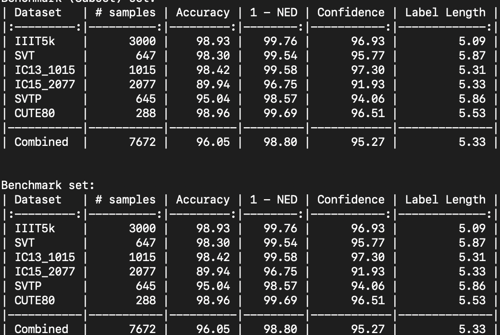

# 관련 지식

## Optical Character Recognition (OCR)

### Needs

영수증이나, 각종 서류라든가, 이미지 혹은 동영상 구석에 있는 UI에 텍스트 정보가 있어 이를 인식하고자 할 때 필요한 기술이다.

딥러닝 이전에는 주로 서류를 스캔한 반듯한 이미지를 인식하는데에 고전적인 기법으로 OCR을 했던 것 같은데, 요즘에 일반 이미지에서도 (Scene Text Recognition) 하려니까 난이도가 더 어려워 지는 듯?

예를들면 아래 이미지. 스타벅스 공식 홈페이지에 있는 이미지를 가져왔다. 이걸 보고 스타벅스 매장임을 인식하려면 어떻게 해야할까?

먼저 텍스트가 있는 영역을 localization한 다음에 해당 영역에 대해 글자를 recognition하여 'STARBUCKS RESERVE ROASTERY'라는 텍스트로 변환해야한다.

<figure><figcaption></figcaption></figure>

그래서 크게 두가지 기술이 필요하다.

1. Text Detection (localization)
2. Text Recognition

두가지 태스크가 나뉘어져 있어서, Scene Text Recognition 관련 연구를 하려면 이미 예쁘게 localization된 이미지에서 recognition 알고리즘만 개발할 수 있도록 되어있다.

예전 연구경험도 그렇고, 현재 (2022년) 진행 하려는 것 또한 Text Detection보다는 recognition쪽에 더 중점을 두고 있어서 이를 위주로 서베이 자료를 정리하려고 한다.

### **참고자료 & 읽을 것**

* STR에 대한 전반적인 설명 [https://arxiv.org/pdf/2006.04305.pdf](https://arxiv.org/pdf/2006.04305.pdf)
